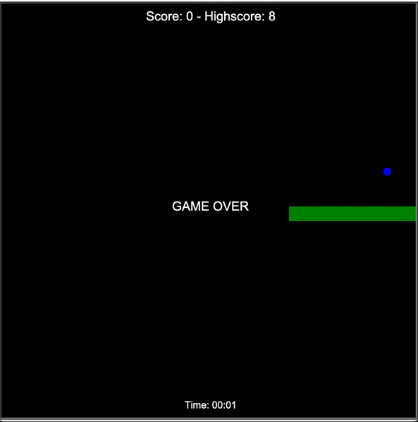

# Snake Game in Py

A classic Snake game implemented in Python.

## Description

This project is a simple implementation of the popular Snake game. The player controls a snake that moves around the screen, eating food to grow longer. The game ends if the snake collides with the screen edges or its own body.

## Features

- Snake movement controlled by arrow keys
- Food spawns randomly on the screen
- Snake grows longer when it eats food
- Score tracking
- Game over when snake collides with walls or itself

# Screens

## Requirements

- Python 3.x
- Pygame library

## Installation

1. Clone this repository:
